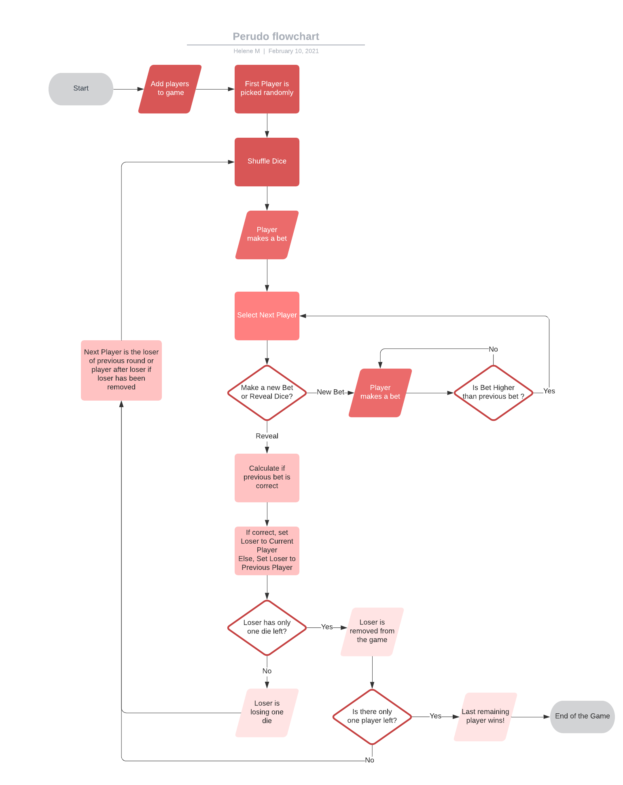

# Perudo Game in Java

Perudo is one of my favorite game to play with friends.
The rules are easy to understand, and there is just the right amount of strategy and fun! 

For this project, I decided to use the Java Programming language and applied the principles of Object Oriented Programming. 

## Quick Overview of the game
The original game is played with opaque cups and dice.
At the beginning of the game, players receive 1 cup and 5 dice each. After shuffling dice inside the cups, players flip their cup (with the dice inside).
Then each player must make a bet on how many dice there is on the table one after the other. Each player can only see his/her dice and must decide to make a higher bet or call the last player a liar!
When a player contests a bid, all the dice are revealed and either the bidder or the caller loses dice, depending on who was correct.

The winner is the last remaining player !

## Project Structure Overview

To build this Perudo game, I created 5 classes. Here is the non-exhaustive description of each class.

A **Dice** Class which holds:
- `int value`: an integer value from 1 to 6; 
- Methods to retrieve the value and generate a new random integer between 1 and 6.

A **Player** Class which holds:
- `String name`: the name of each player
- `ArrayList<Dice>`: An array of 5 Dice with a random value from 1 to 6, representing dice values'. For example:`[1,2,6,6,4]`
- Methods to get the diceValues, shuffleDice, looseADie.  

A **RobotPlayer** Class which inherits from the **Player** Class and holds:
- Methods to decide to bet, and to calculate a new bet based on the previous bet and number of dice.

A **Perudo** Class which holds:
- An `ArrayList<Player> players`: which includes one Player instance, and several RobotPlayer instances.
- `int[] currentBet`: showing the current bet with the number of dice, and dice value. For example: `[5,6]` means the last bet was for 5 dice with a value of 6.
- `Player currentPlayer`: to get a reference of the current player, who can decide to bet or reveal dice.
- Methods to go to next player, get current bet, make a new bet, calculate if a bet is correct, remove a die..

A **GUI** Class which holds:
- All the element of the graphical interface
- Methods to Update the GUI based on the players' actions and go through each Robot Players to make them play.

## Perudo Diagram

To understand how I built the algorithm, here is a diagram representing each step of the game.
